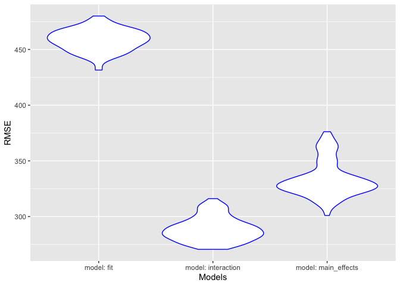
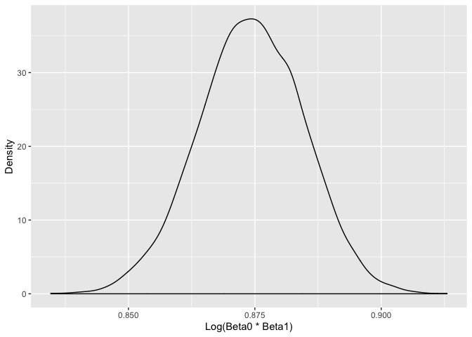

Homework 6
================
Ani Bilazarian
11/20/2019

# Problem 1

*Reading in Birthweight Data*

``` r
birthweight = 
  read_csv("./data/birthweight.csv")
```

*Cleaning Birthweight Data*

``` r
birthweight_clean = 
  birthweight %>% 
  janitor::clean_names() %>% 
  drop_na() %>% 
  mutate(mrace = as.factor(mrace),
         babysex = as.character(babysex),
         frace = as.factor(frace),
         malform = as.character(malform)) %>% 
    mutate(mrace = recode(mrace,
                   '1' = "white", 
                   '2' = "black", 
                   '3' = "asian", 
                   '4' = "puerto rican",
                   '8' = "other")) %>% 
    mutate(frace = recode(frace,
                   '1' = "white", 
                   '2' = "black", 
                   '3' = "asian", 
                   '4' = "puerto rican",
                   '8' = "other",
                   '9' = "unknown")) 
```

*Proposing a regression model based on hypothesized structure*

``` r
fit = lm(bwt ~ mrace + fincome + gaweeks, data = birthweight_clean)

fit %>% 
  broom::tidy() %>% 
  select(term, estimate, p.value) %>% 
  mutate(term = str_replace(term, "mrace", "Mother's Race: ")) %>% 
  knitr::kable(digits = 3)
```

| term                        |  estimate | p.value |
| :-------------------------- | --------: | ------: |
| (Intercept)                 |   843.890 |   0.000 |
| Mother’s Race: black        | \-232.759 |   0.000 |
| Mother’s Race: asian        | \-114.769 |   0.100 |
| Mother’s Race: puerto rican | \-147.107 |   0.000 |
| fincome                     |     0.554 |   0.054 |
| gaweeks                     |    59.802 |   0.000 |

I chose this model as research indicates that mother’s race, income, and
gestational age are determinants of low birthweight. This
[study](https://www.ncbi.nlm.nih.gov/pmc/articles/PMC5014333/) found
that African-American and Latino mothers who smoked and lived in poorer
communities were three times more likely to have an infant with lower
birth weight compared to non-smoking and wealthier women.

*Adding Residuals and Fitted Values*

``` r
birthweight_clean =
  modelr::add_residuals(birthweight_clean, fit) 

birthweight_clean =
modelr::add_predictions(birthweight_clean, fit)
```

*Plotting Residuals versus Fitted values*

``` r
birthweight_clean %>% 
  ggplot(aes(x = pred, y = resid)) + geom_point(color = "red") + labs(x = "Fitted Values", y = "Residuals", title = "Plot of Residuals vs. Fitted Values")
```

<!-- -->

*Comparing my model*

One using length at birth and gestational age as predictors (main
effects only)

``` r
main_effects = lm(bwt ~ blength + gaweeks, data = birthweight_clean)

main_effects %>% 
  broom::tidy() %>% 
  select(term, estimate, p.value) %>% 
  mutate(term = str_replace(term, "mrace", "Mother's Race: ")) %>% 
  knitr::kable(digits = 3)
```

| term        |   estimate | p.value |
| :---------- | ---------: | ------: |
| (Intercept) | \-4347.667 |       0 |
| blength     |    128.556 |       0 |
| gaweeks     |     27.047 |       0 |

One using head circumference, length, sex, and all interactions
(including the three-way interaction) between
these

``` r
interaction = lm(bwt ~ blength + babysex + bhead + blength * babysex + blength * bhead + bhead * babysex + blength * bhead * babysex, data = birthweight_clean)

interaction %>% 
  broom::tidy() %>% 
  select(term, estimate, p.value) %>% 
  mutate(term = str_replace(term, "mrace", "Mother's Race: ")) %>% 
  knitr::kable(digits = 3)
```

| term                   |   estimate | p.value |
| :--------------------- | ---------: | ------: |
| (Intercept)            | \-7176.817 |   0.000 |
| blength                |    102.127 |   0.000 |
| babysex2               |   6374.868 |   0.000 |
| bhead                  |    181.796 |   0.000 |
| blength:babysex2       |  \-123.773 |   0.000 |
| blength:bhead          |    \-0.554 |   0.478 |
| babysex2:bhead         |  \-198.393 |   0.000 |
| blength:babysex2:bhead |      3.878 |   0.000 |

*Plotting each model*

``` r
  birthweight_clean %>% 
  gather_predictions(fit, main_effects, interaction) %>%
  mutate(model = fct_inorder(model)) %>% 
  ggplot(aes(x = blength, y = bwt)) + 
  geom_point(alpha = .5) +
  geom_smooth(method = "lm", color = "red") +
  facet_grid(~model)
```

<!-- -->

*Fit models to training data and obtain RMSEs*

``` r
cv_df = 
crossv_mc(birthweight, 100) 

cv_df = 
cv_df %>% 
mutate(
main_effects = map(train, ~lm(bwt ~ blength + gaweeks, data = .x)),

interaction = map(train, ~lm(bwt ~ blength + babysex + bhead + blength * babysex + blength * bhead + bhead * babysex + blength * bhead * babysex, data = .x)),

fit = map(train, ~lm(bwt ~ mrace + fincome + gaweeks, data = .x))
) %>% 

  mutate(
rmse_model_main_effects = map2_dbl(main_effects, test, ~rmse(model = .x, data = .y)),
rmse_model_interaction = map2_dbl(interaction, test, ~rmse(model = .x, data = .y)),
rmse_model_fit = map2_dbl(fit, test, ~rmse(model = .x, data = .y))
)
```

*Plot prediction error distribution for each model*

``` r
cv_df %>% 
  select(starts_with("rmse")) %>% 
pivot_longer(
    everything(),
    names_to = "model", 
    values_to = "rmse",
    names_prefix = "rmse_") %>% 
  mutate(model = fct_inorder(model)) %>% 
    mutate(model = str_replace(model, "model_", "model: ")) %>% 

  ggplot(aes(x = model, y = rmse)) + geom_violin(color = "blue") + labs(x = "Models", y = "RMSE")
```

<!-- --> We
can see based on the variance in prediction error that the model with
interaction terms has the greatest predictive accuracy.

# Problem 2

*Importing weather data*

``` r
weather_df = 
  rnoaa::meteo_pull_monitors(
    c("USW00094728"),
    var = c("PRCP", "TMIN", "TMAX"), 
    date_min = "2017-01-01",
    date_max = "2017-12-31") %>%
  mutate(
    name = recode(id, USW00094728 = "CentralPark_NY"),
    tmin = tmin / 10,
    tmax = tmax / 10) %>%
  select(name, id, everything())
```

\_Produce estimate of log(Bo^\*B1^) using 5000 bootstrap estimates\_

``` r
set.seed(1)

weather_df %>% 
  modelr::bootstrap(n = 5000) %>% 
  mutate(models = map(strap, ~ lm(tmax ~ tmin, data = .x)),
    results = map(models, broom::tidy)) %>% 
  select(results) %>% 
  unnest(results) %>% 
select(term, estimate) %>% 
  pivot_wider(
names_from = term, values_from = estimate) %>% 
  unnest() %>% 
  janitor::clean_names() %>% 
mutate(log_intercept = log(intercept*tmin)) %>% 
    ggplot(aes(x = log_intercept)) + geom_density() + labs(x = "Log(Beta0 * Beta1)", y = "Density")
```

<!-- -->

This distribution does not have heavy tails indicating that there are
few outliers and data is approximately normally distributed.

*Produce estimate of R Squared using 5000 bootstrap estimates*

``` r
  weather_df %>% 
  modelr::bootstrap(n = 5000) %>% 
  mutate(models = map(strap, ~ lm(tmax ~ tmin, data = .x)),
    results = map(models, broom::glance)) %>% 
  select(results) %>% 
  unnest(results) %>% 
  select(r.squared) %>% 
  ggplot(aes(x = r.squared)) + geom_density() + labs(x = "R Squared", y = "Density", title = "Distribution of R Squared")
```

<!-- -->

Similar to the log distribution, the R squared distribution does not
have heavy tails indicating few outliers and data is approximately
normally distributed.

*95% CI for R.Squared*

``` r
  weather_df %>% 
  modelr::bootstrap(n = 5000) %>% 
  mutate(models = map(strap, ~ lm(tmax ~ tmin, data = .x)),
    results = map(models, broom::glance)) %>% 
  select(results) %>% 
  unnest(results) %>% 
  select(r.squared) %>% 
summarize(
lower_CI = quantile(r.squared, c(.025)),
upper_CI = quantile(r.squared, c(.975))) %>% 
  knitr::kable()
```

| lower\_CI | upper\_CI |
| --------: | --------: |
| 0.8937522 | 0.9270975 |

The 95% CI for R Squared is 0.89 to 0.93.

\_95% CI for the log of beta0\*beta1\_

``` r
weather_df %>% 
  modelr::bootstrap(n = 5000) %>% 
  mutate(models = map(strap, ~ lm(tmax ~ tmin, data = .x)),
    results = map(models, broom::tidy)) %>% 
  select(results) %>% 
  unnest(results) %>% 
select(term, estimate) %>% 
  pivot_wider(
names_from = term, values_from = estimate) %>% 
  unnest() %>% 
  janitor::clean_names() %>% 
mutate(log_intercept = log(intercept*tmin)) %>% 
summarize(
lower_CI = quantile(log_intercept, c(.025)),
upper_CI = quantile(log_intercept, c(.975))) %>% 
  knitr::kable()
```

| lower\_CI | upper\_CI |
| --------: | --------: |
|  1.967353 |  2.058287 |

The 95% CI for the log of beta null hat to beta one hat is 1.97 to 2.06.
